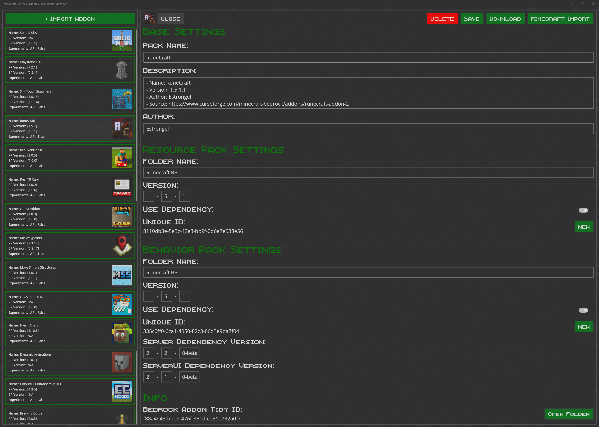

# Minecraft Bedrock: Addon's Cleaner and Manager

## Introduction

BedrockAddonTidy is a Windows application designed to help you store, manage, and export addons for Minecraft Bedrock.

This app was born out of both my appreciation and frustration with mod developers. While I love exploring new mods and admire the creativity behind them, I grew tired of the repetitive process: manually extracting each addon, editing the manifest, and repackaging. Despite the impressive work that goes into these addons, the metadata is often inconsistent or lacking, and even occasionally leads to issues in game.

<table>
	<thead>
		<tr>
			<th>Feature</th>
			<th>Description</th>
		</tr>
	</thead>
	<tbody>
		<tr>
			<td><strong>Update API Version</strong></td>
			<td>Quickly update the API version in your packs to match the latest Minecraft releases, or revert unnecessary beta targeting by some developers. This helps avoid issues with outdated or incorrectly set API versions and reduces the need for experimental features. See <a href="https://learn.microsoft.com/en-us/minecraft/creator/scriptapi/minecraft/server/minecraft-server?view=minecraft-bedrock-stable">@minecraft/server</a> and <a href="https://learn.microsoft.com/en-us/minecraft/creator/scriptapi/minecraft/server-ui/minecraft-server-ui?view=minecraft-bedrock-stable">@minecraft/server-ui</a>.</td>
		</tr>
		<tr>
			<td><strong>Pack Name</strong></td>
			<td>Remove unnecessary details or distracting elements (like excessive colors or emojis) from pack names for a cleaner look.</td>
		</tr>
		<tr>
			<td><strong>Pack Description</strong></td>
			<td>Customize descriptions to include only the information you want — such as helpful chat commands for addon usage.</td>
		</tr>
		<tr>
			<td><strong>Force Folder Names</strong></td>
			<td>.mcaddon files are zip archives containing resource and behavior pack folders. Easily rename these folders to something more meaningful, which is especially useful for server uploads.</td>
		</tr>
		<tr>
			<td><strong>Update Addon Version</strong></td>
			<td>Ensure addon version metadata is always accurate, even when developers forget to update it during releases.</td>
		</tr>
		<tr>
			<td><strong>Force Pack Dependencies</strong></td>
			<td>Automatically set dependencies between resource and behavior packs, so enabling one in-game imports the other — fixing a common oversight missed by developers.</td>
		</tr>
	</tbody>
</table>

## Screenshot

## Roadmap

<table>
	<thead>
		<tr>
			<th>Feature</th>
			<th>Description</th>
		</tr>
	</thead>
	<tbody>
		<tr>
			<td><strong>Merge Packs</strong></td>
			<td>Giving users the ability to merge packs when developers offer the resource pack and behavior pack as separate files.</td>
		</tr>
		<tr>
			<td><strong>Minecraft Direct Copy</strong></td>
			<td>Copy the addons files directly into Minecraft's directory, bypassing the live import process. Why? Nothing much, just to ensure the folder names are not trimmed down to 10 characters. 32 is the actual limit. This is handy for identifying the right addon folder when copying to a private server.</td>
		</tr>
		<tr>
			<td><strong>Notes Field</strong></td>
			<td>Not sure if this is going to be useful, but just giving the user options to wrote notes in the app for each addon.</td>
		</tr>
	</tbody>
</table>
